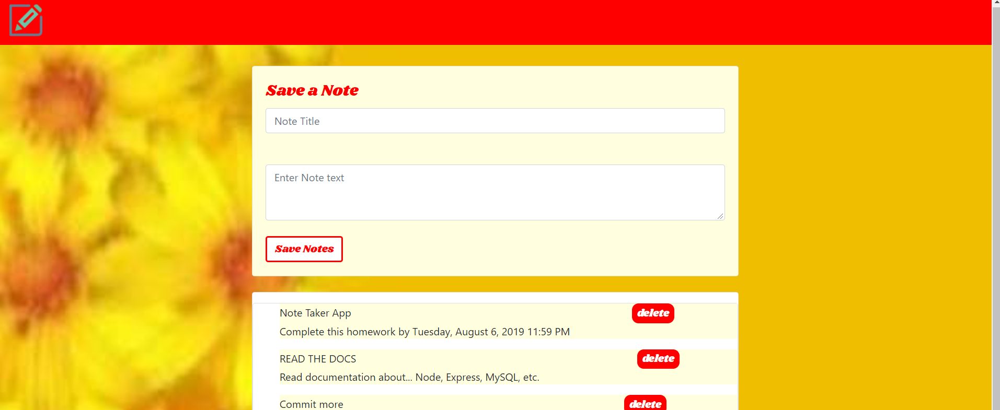

    **Note-taker**     
 #### **Overview**
 #####  User can create, read, and delete notes with this application.

 #### **Technologies used:**
 * Node, Express,Express-handlebar,MySQL

 #### **Screenshot:**
 

 
 

 #### **Code Example**
 * This code takes notes from the database.

 router.get

 ("/allnotesdata", function(req, res)
{

  connection.query("SELECT * FROM notes",function(err,notes)
{

    console.log(notes)

    res.json(notes);

  });

});

function displayNotes() {

    $.get("/allnotesdata", function (notes) {
        console.log("from notes db", notes);
        $(".list").empty();
        for (var i = 0; i < notes.length; i++) {
            var div = $("
").addClass("div");
            var span = $("").text(notes[i].title);
            var p = $("
").text(notes[i].body);
            var buttonDiv = $("<button>").addClass("button-delete").text("delete").attr("name",notes[i].id)
             div.append(span,buttonDiv, p);
            $(".list").append(div);
        }
    })
}

#### **Installation:**

 **NPM packag:**
  <li> Express
  <li> Express-handlebars
  <li> MySql
 

